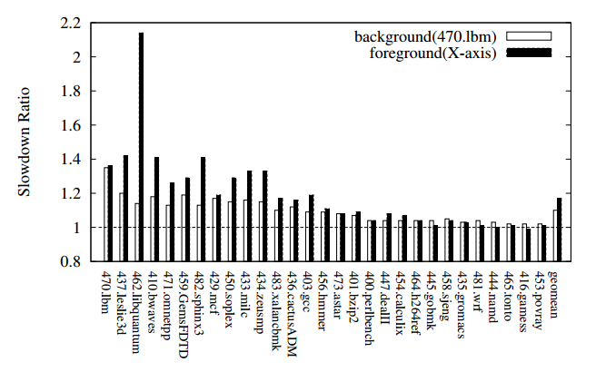
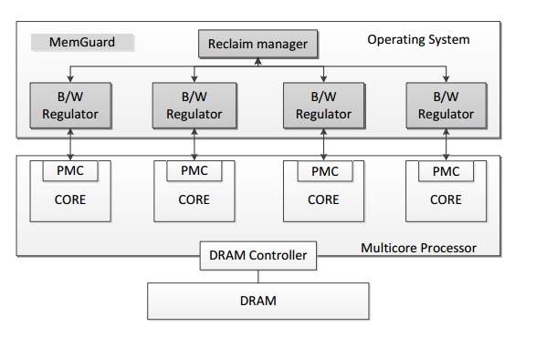

# 多核平台下的内存问题

### 文章一：MemGuard: Memory Bandwidth Reservation System for Efficient Performance Isolation in Multi-core Platforms

### 作者：[Heechul Yun](http://www.ittc.ku.edu/~heechul/), Graduated from University of Illinois at Urbana-Champaign, USA

### 文章来源：RTAS'13

#### 文章贡献与问题

    这篇文章的贡献在于：1、用实验证实并解释了多核平台下，多任务的内存访问存在相互干扰（主要是指内存带宽）；2、提出利用性能隔离方法，将系统整体带宽分解为保证和尽力组件：为每个处理器动态预留保证的带宽，将多余带宽部分用于性能或其他达不到保证的处理器，并在linux内核层面设计并实现了这一套系统。3、利用SPEC benchmark测试和评价该系统。

    发现问题：文章中做了一份实验，将每一个SPEC2006的benchmark单独跑在一个核心上，将另一方固定的内存密集型benchmark（470.lbm）跑在另一个核心上，观察IPC的减速情况。

上图前台bench从左到右内存访问越密集。可以看到，固定的后台bench，会受到前台bench内存访问的影响，或者说是相互影响。

#### 原因与要解决的问题

    根本原因：DRAM芯片上由多个BANK组成，可以并行访问，但是并行度很难预测，完全取决于任务的内存访问模式、内存的物理地址和DRAM控制器的调度。这使得最大可实现的内存带宽成为一个变量。本文要解决的关键问题就是如何尽可能保证系统（各个核心）的内存带宽。

#### 如何构造系统结构

文章构建了一个具备预留和回收机制的系统，为每个核心动态预留内存带宽，预留量由一个静态值和一个前一时期实际使用量为输入的预估值决定；回收机制用于回收每个核心多余预留的内存带宽，并分配给带宽不足的核心。

#### 问题一：适用于什么样的系统？（物理系统约束条件）

1、要求系统具备PMC（Performance Measuring Counters），用于测量测量内存访问利用情况，事实上现代CPU基本满足这一条件。2、要求系统具备独立的LLC，从而规避掉Cache争用的影响（集中关注内存带宽的影响），事实上现代smp CPU基本不满足这一条件，为了规避这个问题，作者将两个集域的4核平台只取每个域的一个核心。3、整个系统采用性能隔离模型，即将多核系统视为一组单核系统，这组单核系统拥有专用的、慢速的内存子系统（通过资源预留的方式，可以实现这种隔离的概念）。

#### 问题二：动态预留量更新时机、依据？

每一个tick会产生时钟中断，从而产生了一个周期性的时间间隔，通过这个周期性的时间段，可以了解系统在该段时间内内存使用状况，并且将状况作为输入，得出下一个时间段的预留预估。

#### 文章存在的某些问题？

1、即使LLC独立，在存在cache的情况下，直接测量带宽是否能准确，或者说SPEC有特殊设置？

2、系统粒度建立在物理核级别，粒度似乎太大。按照文章系统，一旦某个核上带宽不满足，核上所有任务都需要进行重调度，这很明显加大了系统的调度开销。粒度建立在任务级更为合理。但是，建立在任务级，就很可能无法使用PMC直接确定任务的内存使用情况，内存的统计难度会加大。

3、利用系统TICK中断做太多事情，是否会影响系统实时性。

4、结合2和3，这套系统很可能无法应对多任务的情况。

